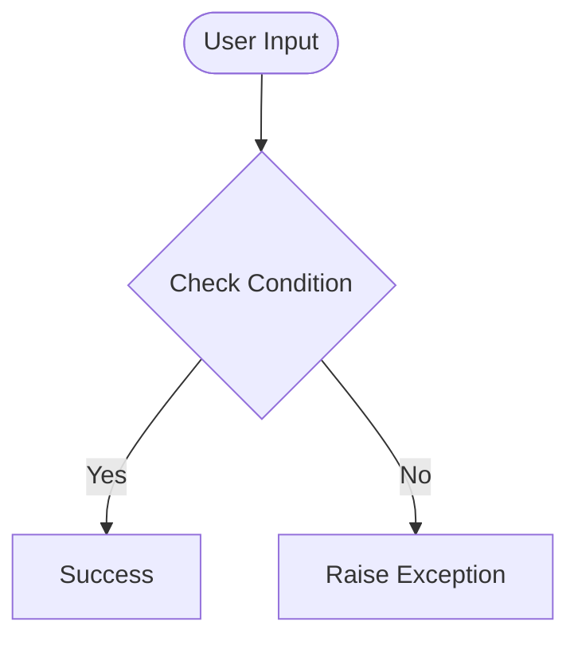

# Day 71 — Deploy your WebApp <!-- omit in toc -->

[](../day_71/main.py)

| **Scope** | **Description**                                                                    |
| :-------: | :--------------------------------------------------------------------------------- |
|   Goal    | Publish the Flask blog online (production deployment).                             |
|   Steps   | Push to GitHub → add Procfile/Gunicorn → deploy on Heroku → switch DB to Postgres. |
|   Stack   | Flask, Git/GitHub, Heroku, Gunicorn, PostgreSQL                                    |

## 📘 Table of contents <!-- omit in toc -->

- [🧠 Concepts Learned](#-concepts-learned)
- [⚠️ Challenges](#️-challenges)
- [✅ Solutions / Insights](#-solutions--insights)
- [📂 Project Structure](#-project-structure)
- [🏗 Architecture](#-architecture)
- [🎯 Next Steps](#-next-steps)

---

## 🧠 Concepts Learned

(Write bullet points here)

## ⚠️ Challenges

(What was confusing / hard)

## ✅ Solutions / Insights

(How you solved it / what finally clicked)

## 📂 Project Structure

```text
day_71/
├── main.py
├── config.py
```

## 🏗 Architecture



## 🎯 Next Steps

(Refactors, extra features, things to revisit)

---

[](day_70.md) [](day_72.md)
