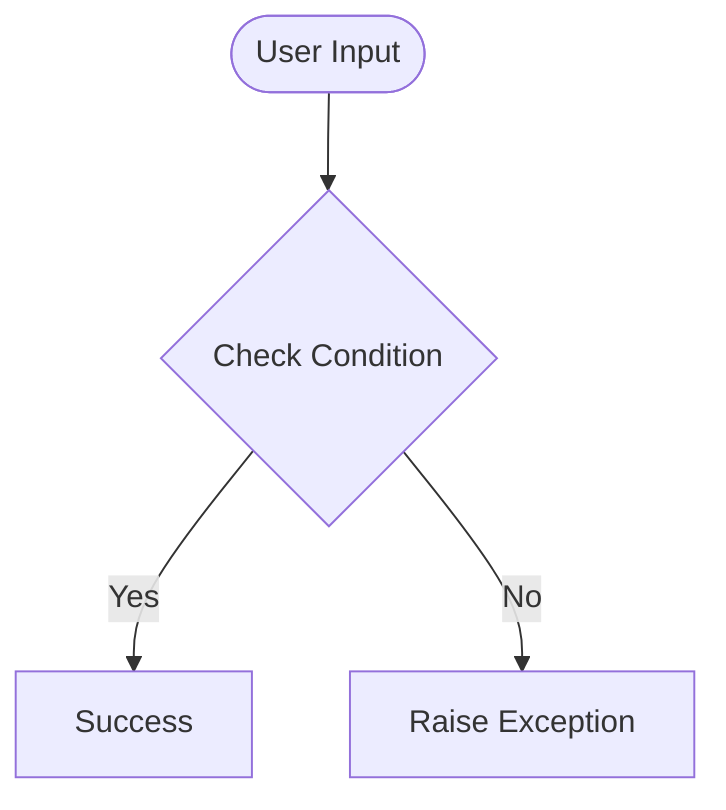

# Day 72 — Data Exploration with Pandas <!-- omit in toc -->

[](../day_72/main.py)  

| **Scope** | **Description** |
|:---------:|:----------------|
|   Goal    | Analyze post-university salary data using Pandas to evaluate earning potential, risk, and category differences across college majors.          |
|   Steps   | Load and inspect the dataset, clean missing values, sort and filter salary metrics, compute growth and spread indicators, and group results by degree category for comparison.         |
|   Stack   | Python, Jupyter Notebook, Pandas, CSV dataset (PayScale survey data).         |

## 📘 Table of contents <!-- omit in toc -->

- [🧠 Concepts Learned](#-concepts-learned)
- [⚠️ Challenges](#️-challenges)
- [✅ Solutions / Insights](#-solutions--insights)
- [📂 Project Structure](#-project-structure)
- [🏗 Architecture](#-architecture)
- [🎯 Next Steps](#-next-steps)

---

## 🧠 Concepts Learned

(Write bullet points here)

## ⚠️ Challenges

(What was confusing / hard)

## ✅ Solutions / Insights

(How you solved it / what finally clicked)

## 📂 Project Structure

```text
day_72/
├── main.py
├── config.py
```

## 🏗 Architecture



## 🎯 Next Steps

(Refactors, extra features, things to revisit)  

---
[](day_71.md) [](day_73.md)
