# Day 72 — Data Exploration with Pandas <!-- omit in toc -->

[](../day_72/main.py)

| **Scope** | **Description**                                                                                                                                                                |
| :-------: | :----------------------------------------------------------------------------------------------------------------------------------------------------------------------------- |
|   Goal    | Analyze post-university salary data using Pandas to evaluate earning potential, risk, and category differences across college majors.                                          |
|   Steps   | Load and inspect the dataset, clean missing values, sort and filter salary metrics, compute growth and spread indicators, and group results by degree category for comparison. |
|   Stack   | Python, Jupyter Notebook, Pandas, CSV dataset (PayScale survey data).                                                                                                          |

## 📘 Table of contents <!-- omit in toc -->

- [🧠 Concepts Learned](#-concepts-learned)
- [⚠️ Challenges](#️-challenges)
- [✅ Solutions / Insights](#-solutions--insights)
- [📂 Project Structure](#-project-structure)
- [🏗 Architecture](#-architecture)
- [🎯 Next Steps](#-next-steps)

---

## 🧠 Concepts Learned

- **Exploration primitives:** `head`, `tail`, `shape`, `columns` to quickly understand dataset size + schema.
- **Missing values mental model:** `NaN` means “missing/unknown value” regardless of column type; `isna()` returns a boolean mask.
- **Filtering with masks:** `df[df.isna().any(axis=1)]` to show only rows with at least one missing value.
- **Series vs DataFrame selection:**
  - `df["col"]` returns a **Series** &#40;1D&#41;
  - `df[["col"]]` returns a **DataFrame** &#40;2D table&#41;
- **Min/max with location:** `idxmax/idxmin` finds the row index for extremes; `loc` retrieves the row.
- **Risk via spread:** “low risk” majors can be proxied by smaller `P90 - P10` spread &#40;less variance/uncertainty&#41;.
- **Group analysis:** `groupby("Group")["Mid-Career Median Salary"].mean()` to compare category averages.

## ⚠️ Challenges

- Understanding **percentiles** &#40;10th/90th&#41; as cutoffs in a sorted distribution.
- Confusion between **NaN as a term** vs “not-a-number type”; in Pandas it’s mainly used as the universal missing marker.
- Distinguishing **Series vs DataFrame** display behavior in notebooks.
- Getting comfortable with the `groupby → select column → aggregate` flow.
- Extra credit: PayScale pages no longer expose the same raw table format as the course dataset.

## ✅ Solutions / Insights

- Percentiles clicked once I mapped them to **rank positions** in a sorted list and understood interpolation.
- For “show me the full row as a table”, use:
  - `clean_df.loc[[idx]]` &#40;double brackets keep it 2D&#41; instead of `clean_df.loc[idx]`.
- For missing rows, the clean pattern is:
  - `rows_with_nan = df[df.isna().any(axis=1)]`
- The most readable groupby pattern:
  - `clean_df.groupby("Group")["Mid-Career Median Salary"].mean()`
  - or if you need multiple columns: `clean_df.groupby("Group")[["col1","col2"]].mean()`
- VS Code notebook workflow works well with a **shared root `.venv`** &#40;uv&#41; and keeps everything committed and reproducible.

## 📂 Project Structure

```text
day_72/
├── main.ipynb
└── salaries_by_college_major.csv
```

## 🏗 Architecture

```mermaid
graph TD;
    A[Load CSV] --> B[Inspect dataframe #40;head/shape/columns#41;]
    B --> C[Check missing values &#40;isna&#41;]
    C --> D[Clean dataset #40;dropna#41;]
    D --> E[Compute extremes #40;min/max + idxmin/idxmax#41;]
    E --> F[Spread metrics #40;P90 - P10#41;]
    F --> G[Group comparison #40;groupby mean#41;]
    G --> H[Conclusions]
```



## 🎯 Next Steps

- Add a short “Repro” cell in the notebook: print Python + Pandas versions.
- Refactor repeated min/max logic into small helper functions in `main.py` (if you want to keep Python parity with notebook).
- Extra credit: identify alternative public sources for updated salary distributions (percentiles) or build a small scraper for **summary tables** where available.

---

[](day_71.md) [](day_73.md)
