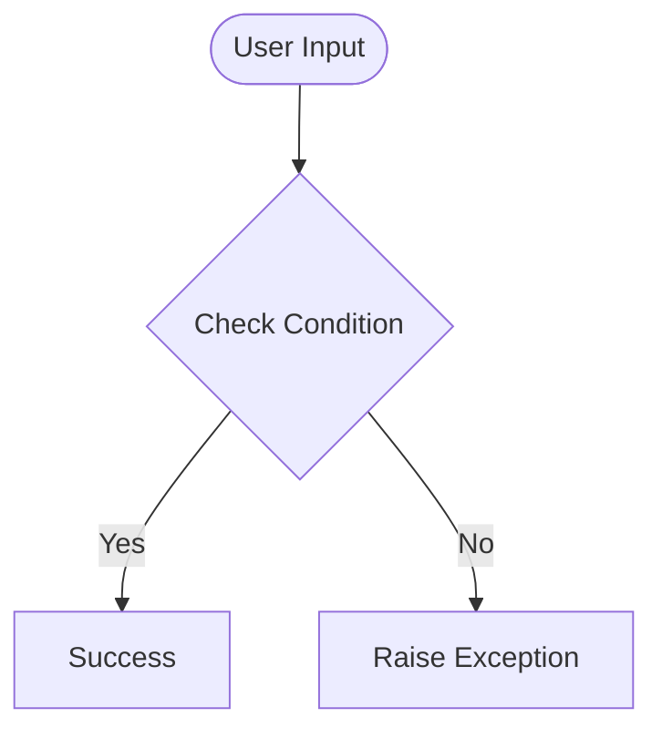

# Day 73 — Data Visualization with Matplotlib <!-- omit in toc -->

[](../day_73/main.py)  

| **Scope** | **Description** |
|:---------:|:----------------|
|   Goal    | Analyze the evolution of programming language popularity over time using StackOverflow data by transforming raw CSV data into a structured time-series format and visualizing trends with line charts.          |
|   Steps   | Load the dataset into a Pandas DataFrame with explicit column names, inspect and validate the structure of the data, convert and handle the date column for time-series analysis, group data by date and programming language to aggregate post counts, reshape the dataset using a pivot operation to move from long to wide format, and finally plot each language as a time-series line chart using Matplotlib to compare trends.         |
|   Stack   | Python with Pandas for data manipulation and transformation, Matplotlib for data visualization, and Jupyter Notebook for exploratory analysis and iterative development of the workflow.         |

## 📘 Table of contents <!-- omit in toc -->

- [🧠 Concepts Learned](#-concepts-learned)
- [⚠️ Challenges](#️-challenges)
- [✅ Solutions / Insights](#-solutions--insights)
- [📂 Project Structure](#-project-structure)
- [🏗 Architecture](#-architecture)
- [🎯 Next Steps](#-next-steps)

---

## 🧠 Concepts Learned

(Write bullet points here)

## ⚠️ Challenges

(What was confusing / hard)

## ✅ Solutions / Insights

(How you solved it / what finally clicked)

## 📂 Project Structure

```text
day_73/
├── main.py
├── config.py
```

## 🏗 Architecture



## 🎯 Next Steps

(Refactors, extra features, things to revisit)  

---
[](day_72.md) [](day_74.md)
