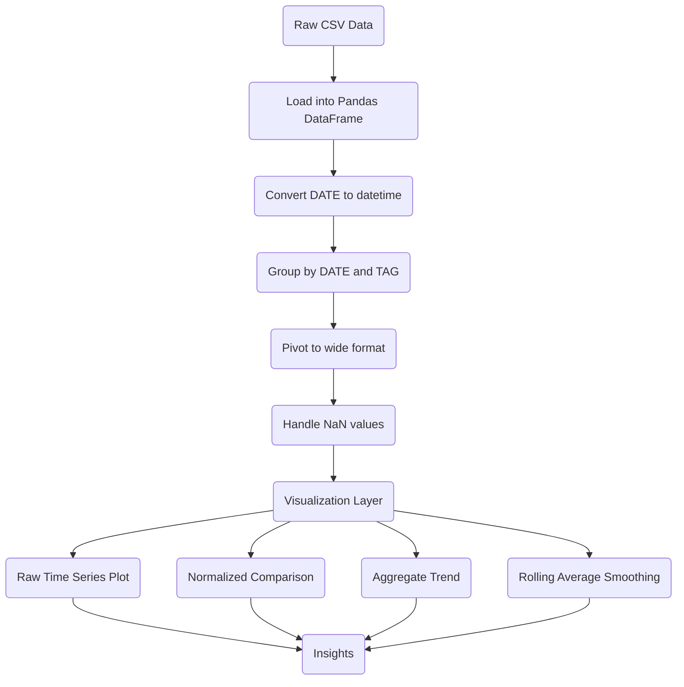

# Day 73 — Data Visualization with Matplotlib <!-- omit in toc -->

[](../day_73/main.py)

| **Scope** | **Description**                                                                                                                                                                                                                                                                                                                                                                                                                      |
| :-------: | :----------------------------------------------------------------------------------------------------------------------------------------------------------------------------------------------------------------------------------------------------------------------------------------------------------------------------------------------------------------------------------------------------------------------------------- |
|   Goal    | Analyze the evolution of programming language popularity over time using StackOverflow data by transforming raw CSV data into a structured time-series format and visualizing trends with line charts.                                                                                                                                                                                                                               |
|   Steps   | Load the dataset into a Pandas DataFrame with explicit column names, inspect and validate the structure of the data, convert and handle the date column for time-series analysis, group data by date and programming language to aggregate post counts, reshape the dataset using a pivot operation to move from long to wide format, and finally plot each language as a time-series line chart using Matplotlib to compare trends. |
|   Stack   | Python with Pandas for data manipulation and transformation, Matplotlib for data visualization, and Jupyter Notebook for exploratory analysis and iterative development of the workflow.                                                                                                                                                                                                                                             |

## 📘 Table of contents <!-- omit in toc -->

- [🧠 Concepts Learned](#-concepts-learned)
- [⚠️ Challenges](#️-challenges)
- [✅ Solutions / Insights](#-solutions--insights)
- [📂 Project Structure](#-project-structure)
- [🏗 Architecture](#-architecture)
- [🎯 Next Steps](#-next-steps)

---

## 🧠 Concepts Learned

- Using `groupby()` to aggregate data across dimensions (date, language)
- Converting string dates to proper datetime objects with `pd.to_datetime()`
- Reshaping data from long → wide format using `pivot()` for time-series analysis
- Understanding how missing values (NaN) emerge from reshaping operations
- Handling missing data using `.fillna()` and validating with `.isna().values.any()`
- Plotting multiple time series dynamically using loops instead of hardcoding
- Styling Matplotlib charts (figure size, labels, axis limits, legends)
- Normalizing data to compare relative trends across different scales
- Aggregating across columns to extract system-level signals (`sum(axis=1)`)
- Applying rolling averages (`.rolling().mean()`) to smooth noisy time-series data
- Distinguishing between raw signals and smoothed trends for better interpretation

## ⚠️ Challenges

- Understanding why `NaN` values appeared after using `pivot()`
- Confusion between plotting multiple series vs creating multiple plots
- Interpreting what the chart actually represents (language popularity vs platform usage)
- Managing readability when plotting many languages simultaneously (spaghetti effect)
- Misinterpreting normalized data scale vs raw values
- Initial confusion around how Matplotlib handles multiple `plt.plot()` calls
- Recognizing that visual patterns do not automatically imply causation

## ✅ Solutions / Insights

- Realized that `pivot()` creates `NaN` where data does not exist for a given combination
- Understood that multiple `plt.plot()` calls draw on the same figure unless a new one is created
- Used loops over `reshaped_df.columns` to make plotting dynamic and scalable
- Applied normalization (`df / df.max()`) to compare relative trends instead of absolute values
- Created an aggregate metric (`sum(axis=1)`) to detect platform-level behavior
- Applied rolling averages to remove noise and highlight real trends
- Identified that the observed decline is not language-specific but system-wide
- Distinguished between correlation and causation when interpreting data (e.g., AI vs StackOverflow decline)
- Recognized that StackOverflow data reflects developer behavior, not actual language adoption
- Learned to separate data transformation, visualization, and interpretation as distinct steps

## 📂 Project Structure

```text
day_73/
├── main.ipynb
├── config.py
```

## 🏗 Architecture



## 🎯 Next Steps

- Apply linear regression to quantify trends and measure slope of decline
- Focus analysis on recent years (last 3–5 years) for more relevant insights
- Identify top N languages dynamically and create cleaner comparative charts
- Explore correlation with external signals (e.g., AI adoption trends)
- Introduce moving averages with different window sizes for comparison
- Experiment with logarithmic scales for better visualization of smaller languages
- Transition from Matplotlib to more advanced libraries (e.g., Plotly, Seaborn)
- Package the analysis into a reusable pipeline or function

---

[](day_72.md) [](day_74.md)
