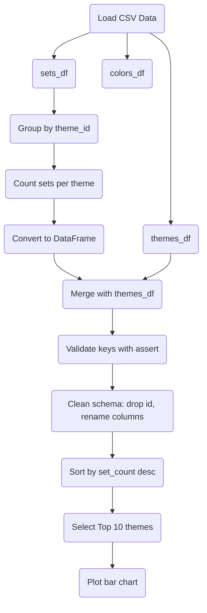

# Day 74 — Analyze LEGO Dataset <!-- omit in toc -->

[](../day_74/main.py)

| **Scope** | **Description**                                                                                                                                                      |
| :-------: | :------------------------------------------------------------------------------------------------------------------------------------------------------------------- |
|   Goal    | Analyze LEGO datasets with Pandas by aggregating, merging, and visualizing data to answer questions about set size, themes, yearly growth, and complexity over time. |
|   Steps   | Load the datasets, explore key questions, aggregate and merge the data, then visualize trends and interpret the results.                                             |
|   Stack   | Python, Pandas, Matplotlib, Jupyter Notebook or Google Colab, and CSV datasets.                                                                                      |

## 📘 Table of contents <!-- omit in toc -->

- [🧠 Concepts Learned](#-concepts-learned)
- [⚠️ Challenges](#️-challenges)
- [✅ Solutions / Insights](#-solutions--insights)
- [📂 Project Structure](#-project-structure)
- [🏗 Architecture](#-architecture)
- [🎯 Next Steps](#-next-steps)

---

## 🧠 Concepts Learned

- Grouping data using `groupby()` and aggregating with functions like `count()` and `nunique()`
- Understanding the difference between Series and DataFrame outputs in Pandas
- Using `.agg()` for flexible, multi-column aggregations
- Sorting and extracting top records using `sort_values().head()`
- Merging DataFrames with `pd.merge()` using:
  - `on=...` when column names match
  - `left_on` / `right_on` when they differ
- Understanding Primary Key vs Foreign Key relationships (`id` vs `theme_id`)
- Validating joins using `assert` to enforce data integrity (fail-fast approach)
- Cleaning merged DataFrames by dropping redundant columns and renaming for clarity
- Building bar charts with Matplotlib for categorical comparisons

## ⚠️ Challenges

- Confusion between Series vs DataFrame behavior after `groupby()`
- Understanding why `.agg()` is useful compared to direct aggregation methods
- Handling duplicate columns after merge (`id` vs `theme_id`)
- Deciding which column to keep after a join
- Misunderstanding slicing (`[:1]` vs `[:-1]`) and its impact on plotting
- Conceptual confusion between `if` and `assert`

## ✅ Solutions / Insights

- Realized that `groupby()` returns a grouped object that needs aggregation to become usable
- Understood that `.agg()` provides flexibility for multi-column transformations
- Learned that joins are based on matching values, not column names
- Used `assert` to validate that foreign keys and primary keys match before dropping columns
- Adopted a clean pattern: merge → validate → drop → rename
- Understood that `assert` is for enforcing assumptions, while `if` is for branching logic
- Fixed slicing mistakes by recognizing that `[:-1]` excludes the last element
- Improved readability by using explicit sorting before selecting top values

## 📂 Project Structure

```text
day_74/
├── Lego_Analysis_for_Course.ipynb
├── assets
│   ├── bricks.jpg
│   ├── lego_sets.png
│   ├── lego_themes.png
│   └── rebrickable_schema.png
├── config.py
└── data
    ├── colors.csv
    ├── sets.csv
    └── themes.csv
```

## 🏗 Architecture



## 🎯 Next Steps

- Refactor plots using Pandas `.plot()` for more concise syntax
- Explore multi-aggregation with `.agg()` across multiple columns
- Apply the same workflow to larger datasets (scalability check)
- Translate this pipeline into SQL to reinforce relational understanding
- Practice more joins with different key structures (1-to-many, many-to-many)
- Start thinking about performance implications for large datasets (10M+ rows)

---

[](day_73.md) [](day_75.md)
