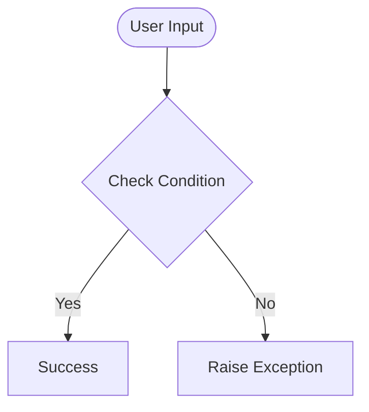

# Day 74 — Analyze LEGO Dataset <!-- omit in toc -->

[](../day_74/main.py)  

| **Scope** | **Description** |
|:---------:|:----------------|
|   Goal    | Analyze LEGO datasets with Pandas by aggregating, merging, and visualizing data to answer questions about set size, themes, yearly growth, and complexity over time.          |
|   Steps   | Load the datasets, explore key questions, aggregate and merge the data, then visualize trends and interpret the results.         |
|   Stack   | Python, Pandas, Matplotlib, Jupyter Notebook or Google Colab, and CSV datasets.         |

## 📘 Table of contents <!-- omit in toc -->

- [🧠 Concepts Learned](#-concepts-learned)
- [⚠️ Challenges](#️-challenges)
- [✅ Solutions / Insights](#-solutions--insights)
- [📂 Project Structure](#-project-structure)
- [🏗 Architecture](#-architecture)
- [🎯 Next Steps](#-next-steps)

---

## 🧠 Concepts Learned

(Write bullet points here)

## ⚠️ Challenges

(What was confusing / hard)

## ✅ Solutions / Insights

(How you solved it / what finally clicked)

## 📂 Project Structure

```text
day_74/
├── main.py
├── config.py
```

## 🏗 Architecture



## 🎯 Next Steps

(Refactors, extra features, things to revisit)  

---
[](day_73.md) [](day_75.md)
